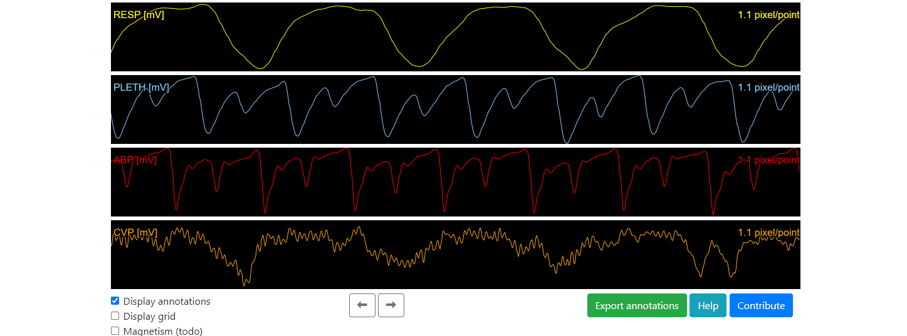

# SignalAnnotation

Open-Source, Web-based application to Annotate signal, timeseries, waveforms...

Preview here: https://sigannot.juliendubiel.net/



Current state: 

* Load data:
  * [ ] Add a new signal 
    * [ ] From uploaded json file
    * [ ] From uploaded csv file
    * [x] From hardcoded json file link (for demo)
    * [ ] From hardcoded csv file link (for demo)
  * [ ] Delete a signal
  * [ ] Directly from Physionet for immediate public physiological data annotation 
* Display data:
  * [x] Zoom in/out using ctrl+mouse scrool
  * [ ] Zoom in/out using interface buttons
  * [x] Move forward/backward using keyboard arrows
  * [x] Move forward/backward using interface buttons
  * [x] Display a grid
  * [ ] Specify grid spacing  
* Annotate:
  * [x] Select a single-sample
  * [x] Select a range
  * [ ] Edit annotation types
  * [x] Delete an annotation
* [x] Help button
* [ ] Export annotations
* Future functionnality:
* [ ] Store modifications in localstorage
* [ ] Fast scroll using a small preview of all the signal like sublimetext
* [ ] Implement magnetism :
  * [ ] to easily click on specific attributes of the signal (for example peaks)
  * [ ] to simplify editing annotations that are single-sample wide
* [ ] Keyboard shortcuts for fast annotation

## Run the application

This is currently a simple HTML file that you can open with your web-browser : open the `example.html` file.
The data displayed by example.html is loaded from `test_data.json`.

The format of the json file must be like this:

```json
{"sig_name": ["My first signal", "My second signal"],"data":[[1, 1, 2, 1, 0, ...], [0.45,0.88, 0.98, 1.35...]]}
```

Where the sig_name list is a list of title for you signals, and data contains a list of list of numerics corresponding to your signals.


## Development

This application is developped as a library file : `annotator.js`. `example.html` is an example usage of the library.

It only depends on the excellent Concrete.js library  : http://www.concretejs.com/

